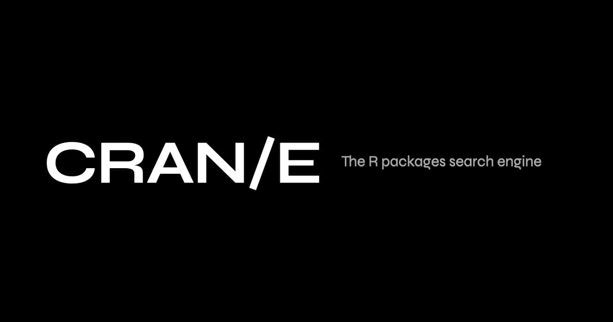

 
 
 

<h2 align="center">
<a href="https://www.cran-e.com">CRAN/E</a>
</h2>

CRAN/E is a modern PWA (Progressive Web App) that serves as a search engine and information display for packages hosted on CRAN. CRAN/E means 'The Comprehensive R Archive Network, Enhanced' and aims at finding R-packages as fast as possible.

 
 
 
 
 

# About

This repository contains all code required to build the Frontend of CRAN/E. We decided to develop it as OSS as we believe in the advantage of a strong community as well as transparency regarding our development.

> CRAN/E is not a package hosting solution for R-code. It's sole purpose is to provide a simple and effective interface for finding packages hosted on CRAN.

## Motivation

The official [CRAN](https://cran.r-project.org/) is in a desperate visual state. Although it's using a very simple structure and basically no potentially distracting styling, using the original site is hard for a few reasons:

- no search interface
- all packages in the overview get loaded at once
- using outdated and deprecated technology, such as `<frameset>`

Therefore we decided to develop a new user interface with search capabilities, that's working on all screen classes using state-of-the-art APIs.

# Structure

This repo currently only uses the `web`-directory for the PWA codebase. Subsequent releases will introduce more apps (e.g. for Android or Windows) w/ their respective directories.

# Contribution

We openly encourage everyone to submit bug reports and new ideas to consistently improve the overall app experience.

## Feature requests

For new features you want to add, please use the **Github Discussions** feature of this repo. We don't blindly accept feature requests as issues. Each feature requests is discussed first, and if a consent is achieved, the progress for implementing it will be tracked via an issue.

## Bug reports

For new bug reports, please create an issue in this repository. The issue setup will guide through the necessary data required for submission.

# Application architecture

Please visit the wiki-pages of this repo for an overview of the architecture.

# Maintainer

This code is mainly created and maintained by [flaming.codes](https://flaming.codes).
